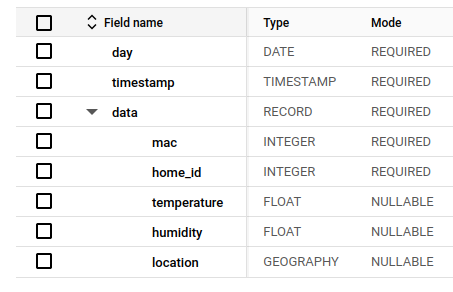
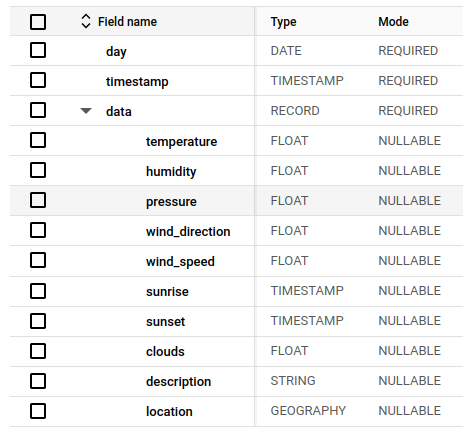
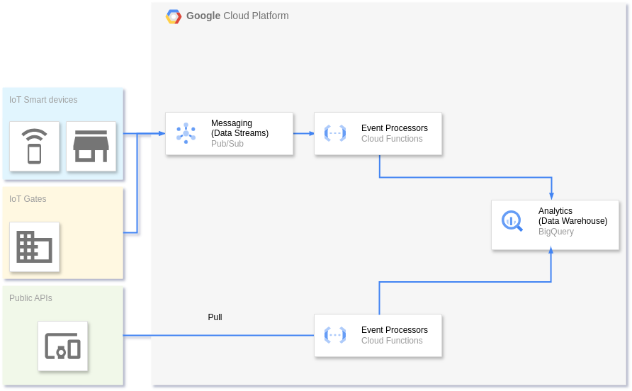
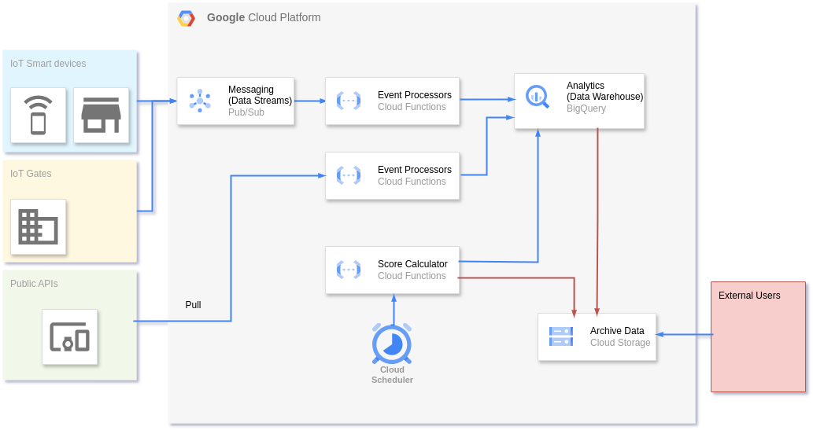

# Designing scalable system to estimate the Livability Score using readings from multiple sensors

This is the coding part of the IoT project "Designing scalable system to estimate the Livability Score 
using readings from multiple sensors"

The CoLab with EDA can be found here:

https://colab.research.google.com/drive/1HkPLzr-0rOI0DGFfpil3vhfFbePAtYSA

The archived data from tables `sensor_data.sensor_thermo_beacon` and `sensor_data.weather_data` can be downloaded 
from GCS bucket `gs://livability-score-archive-data` (available to view via URL 
https://console.cloud.google.com/storage/browser/livability-score-archive-data).

For convenience and as an example, the data for the week 2024/12/01 - 2024/12/07 is duplicated in current
repository (folder [data](/data)), mirroring the folder structure in GCS bucket. 

## Contents
* [Introduction](#introduction)
* [Sensors](#sensors)
* [Data collecting and processing](#data-collecting-and-processing)
* [Cloud Architecture in Details](#cloud-architecture-in-details)
* [Getting started](#getting-started)
* [Cloud deployment](#cloud-deployment)
* [FinOps consideration](#finops-consideration)
* [References](#references)

## Introduction

Our goal is to create a highly scalable system to calculate and publish the _livability score_ - a metric designed 
to estimate the quality of life in a specific house, in a specific region/city, which should be standardized and 
included in a house price tag along with the Energy Performance Certificate (EPC) and other metrics.

In our PoC we are considering two data sources - one is the thermometer/hygrometer to be installed in room and 
the other one is the data from publicly available API at https://openweathermap.org/api

In our [colab](https://colab.research.google.com/drive/1HkPLzr-0rOI0DGFfpil3vhfFbePAtYSA) we have developed 
the statistical model of the _livability score_ which is calculated taking into account the data collected from various 
sources.

## Sensors

We aim to collect data from the thermometer/hygrometer sensor which potentially could have the generic schema with or
without timestamps, other technical fields, etc. We are building our system on the basis of the following guidelines:

* loosely coupled architecture
* embracing FinOps from day one
* data access easiness for the Data Scientists, Analytics and Developer teams

The first principle means each part of the system should communicate with another one via interfaces and APIs. In our
system such interface will be the _schema_ of intermediate tables to store the sensor data.

Each class of sensor will have its own table schema, independent of data actually generated by sensor.
This will decouple the analytics from data collection.

For example, for thermometer/hygrometer sensor the schema will contain two data fields - temperature and humidity, and
the collection script will be responsible to correctly query sensor and prepare the data points to store in a correct 
format. The actual sensor data points may contain more technical fields, but we are going to ignore them since they
do not have much of business value.

The second principle emphasise the importance of optimal resource utilization and the culture of of cost-consciousness, 
what could become the prime factor when scaling the design.

The third principle becomes important during phases of development of new score or running large-scale analytics, 
when Data Science teams need the data for specific period of time.

The next figures depict the schema of two tables

<div style="display: flex; justify-content: space-between;">
  <div align="center">
    
    <p>Figure 1: Thermometer/Hygrometer schema.</p>
  </div>
  <div align="center">
    
    <p>Figure 2: Weather data schema.</p>
  </div>
</div>

## Data collecting and processing

The next picture shows the design on high level for the first part - data collection and aggregation in Big Query tables.
We are using GCP as a main cloud platform to conduct all data collection and processing.

<div style="display: flex; justify-content: space-between;">
  <div align="center">
    
    <p>Figure 3: High level architecture.</p>
  </div>
</div>

We consider two types of scripts:

1. Scripts to collect data from local sensors installed in home via BLE. Such scripts should be designed to run in the 
infinite loop periodically querying sensor. The example of such script is 'sensor_reader.py' (can be found in the root
folder on this repository)
2. Scripts to collect data points from publicly available APIs on the web. The example of such API which we are going to us 
is http://api.openweathermap.org/api. The example of script which is designed to collect such type of data can be found
in `weather_bot.py`

In our implementation both scripts are configurable through properties file `main.properties` and `sensor_reader.properties`
respectively.  `sensor_reader.py` requires some basic metadata about sensor, such as mac_address, the GPS coordinates of
sensor and the UUIDs of read and write characteristics.

On the other hand, `weather_bot.py` requires the latitude and longitude of geography point on Earth to get 
the weather information.

Both scripts are designed around schemas and meet the requirements of loosely coupled architecture we mentioned earlier.
Both scripts are designed to publish collected data to the PubSub topic `sensor_data`

## Cloud Architecture in Details

The next picture shows the design with details

<div style="display: flex; justify-content: space-between;">
  <div align="center">
    
    <p>Figure 4: System architecture.</p>
  </div>
</div>

We define the five distinct points in our design:

1. This is a loosely coupled architecture, where all communication between different stages and services is implemented
through using tables with  stable schema in Big Query
2. High level of throughput, robustness and scalability are provided by scalable services at GCP. For example, messages 
from millions of devices are queued in PubSub and processed to appropriate tables in BiqQuery by elastic cluster of 
Cloud Functions 
3. To calculate the score the 1-2 weeks worth of data is needed. The score is calculated on scheduled basis and the
result is stored as a vector to specific path at GCS. The data from BigQuery tables then is archived to GCS in `COLDLINE` class
4. The system is easily extensible via adding support for additional type of Event Processors, which can process output
from sensors of various nature. Consistency is preserved thanks to loosely coupled architecture
5. The system is designed with FinOps in mind (see the section below for cost estimation of our solution)

The p.3 currently is implemented as a PoC, through notebook at Colab; pp. 4 and 5 are design recommendations and
implemented as the architecture (wasn't implemented in our PoC)

### Security consideration

To send a message to PubSub topic, the script uses a specific Service Account with the minimum necessary 
permissions. Since in such situation many devices are using the same SA, this potentially can be viewed as an issue
from a security perspective due to increased attack surface. 

To mitigate this problem, we can propose to use the groups of SAs, partitioned geographically or by other criteria. 

## Getting started

For local tests create the venv first:

```shell
python3 -m venv venv
source ./venv/bin/activate
pip install -r requirements.txt
```

Signup at https://openweathermap.org/api/ and get the api key, and set it as a permanent env variable 
with name `OPENWEATHER_API_KEY` on your machine (f.e. running the command `export OPENWEATHER_API_KEY=<key>`).
Integrate other environment variables:

```shell
source scripts/set_env.sh
```

Run `weather_bot.py` to get the weather data points for locations specified in `main.properties` file:

```shell
python3 weather_bot.py
```

## Cloud deployment

Required pre-requisites: the latest version of `gcloud` installed.

Create a new project at GCP and modify the `scripts/set_env.sh` script with your value of `PROJECT_ID`.


```shell

gcloud --version
bq version
source scripts/set_env.sh 
gcloud projects create "$PROJECT_ID"
gcloud config set project "$PROJECT_ID"
gcloud config get-value project
```

After creation enable billing (could take up to 5 min for GCP to move it from the sandbox mode)

Create necessary infrastructure (SAs, PubSub topics, BigQuery tables, etc)

```shell
gcloud services enable pubsub.googleapis.com``
gcloud services enable biqquery.googleapis.com
gcloud services enable cloudscheduler.googleapis.com
gcloud services enable cloudfunctions.googleapis.com
gcloud services enable cloudbuild.googleapis.com
gcloud services enable secretmanager.googleapis.com
gcloud services enable run.googleapis.com
gcloud services enable eventarc.googleapis.com
gcloud services enable bigquerydatatransfer.googleapis.com

gcloud pubsub topics create sensor_data
gcloud pubsub topics create meteo_data
scripts/create_dataset.sh
```

Create SA with role `roles/pubsub.publisher` to send messages to PubSub topic:

```shell
gcloud iam service-accounts create dev-sensor-sa --display-name="Sensor SA"
gcloud projects add-iam-policy-binding "$PROJECT_ID" \
  --member="serviceAccount:dev-sensor-sa@$PROJECT_ID.iam.gserviceaccount.com" \
  --role=roles/pubsub.publisher
gcloud iam service-accounts keys create dev-sensor-sa-key.json \
  --iam-account=dev-sensor-sa@$PROJECT_ID.iam.gserviceaccount.com
gcloud projects add-iam-policy-binding $PROJECT_ID \
    --member=serviceAccount:$PROJECT_ID@appspot.gserviceaccount.com  \
    --role=roles/secretmanager.secretAccessor
```

Note the name of secret key `dev-sensor-sa-key.json` - it has to be used on each machine which will run python scripts to
collect sensor data to publish messages to PubSub topic.

Create secret with name `OPENWEATHER_API_KEY` and value for the secret key to access http://api.openweathermap.org/api:

```shell
gcloud secrets create OPENWEATHER_API_KEY \
  --replication-policy="automatic" \
  --data-file=- < <(echo -n "$OPENWEATHER_API_KEY")
```

Create bucket in `COLDLINE` class to store weekly amount of sensor data and make it public:

```shell
gcloud storage buckets create gs://livability-score-archive-data \
  --project=$PROJECT_ID \
  --default-storage-class=COLDLINE \
  --location=us-east1  \
  --uniform-bucket-level-access
gsutil iam ch allUsers:roles/storage.objectViewer gs://livability-score-archive-data
```

### Testing Cloud Functions locally:

```shell
functions-framework --target=event_processor --port=8888
```

```shell
gcloud alpha functions deploy local cf_test \
    --entry-point=event_processor \
    --port=8888 \
    --runtime=python312

```
This is the example of sample message:

```shell
[{\"day\": \"2024-11-29\", \"timestamp\": \"2024-11-29T14:33:35.855Z\", \"data\": {\"mac\":123,\"temperature\": 22.938,\"humidity\": 43.312}}]
```

```shell
curl localhost:8888 \
  -X POST \
  -H "Content-Type: application/json" \
  -H "ce-id: 123451234512345" \
  -H "ce-specversion: 1.0" \
  -H "ce-time: 2020-01-02T12:34:56.789Z" \
  -H "ce-type: google.cloud.pubsub.topic.v1.messagePublished" \
  -H "ce-source: //pubsub.googleapis.com/projects/dev-iot-application/topics/sensor_data" \
  -d '{"message": {"data": "W3siZGF5IjogIjIwMjQtMTEtMjkiLCAidGltZXN0YW1wIjogIjIwMjQtMTEtMjlUMTQ6MzM6MzUuODU1WiIsICJkYXRhIjogeyJtYWMiOjEyMywidGVtcGVyYXR1cmUiOiAyMi45MzgsImh1bWlkaXR5IjogNDMuMzEyfX1dCg==", 
  "attributes": {"dataset_id":"sensor_data", "table_id":"sensor_thermo_beacon"}}, 
  "subscription": "projects/MY-PROJECT/subscriptions/MY-SUB"}'
```

or, for testing in the cloud console:
```shell
{
  "_comment": "data is base64 encoded string",
  "data": "W3siZGF5IjogIjIwMjQtMTEtMjkiLCAidGltZXN0YW1wIjogIjIwMjQtMTEtMjlUMTQ6MzM6MzUuODU1WiIsICJkYXRhIjogeyJtYWMiOjEyMywidGVtcGVyYXR1cmUiOiAyMi45MzgsImh1bWlkaXR5IjogNDMuMzEyfX1dCg==",
  "attributes": {"dataset_id":"sensor_data","table_id":"sensor_thermo_beacon"}
}
```

### Deployment of cloud functions

```shell
gcloud functions deploy event_processor \
--region=us-central1 \
--runtime=python310 \
--source=. \
--entry-point=event_processor \
--trigger-topic=sensor_data \
--allow-unauthenticated \
--set-env-vars PROJECT_ID=$PROJECT_ID
```

```shell
gcloud functions deploy meteodata_event \
--region=us-central1 \
--runtime=python310 \
--source=. \
--entry-point=meteodata_event \
--trigger-topic=meteo_data \
--allow-unauthenticated \
--set-env-vars PROJECT_ID=$PROJECT_ID
```

Create a scheduler to invoke `meteodata_event` every 5 minutes 

```shell
gcloud scheduler jobs create pubsub meteo_data_job  \
  --schedule="*/5 * * * *"  \
  --topic=meteo_data \
  --message-body="event" \
  --location=us-central1
```

## FinOps consideration


## References

[1] https://cloud.google.com/functions/docs/running/functions-emulator

[2] https://colab.research.google.com/drive/1HkPLzr-0rOI0DGFfpil3vhfFbePAtYSA

[3] https://cloud.google.com/bigquery/docs/exporting-data#sql

[4] 
